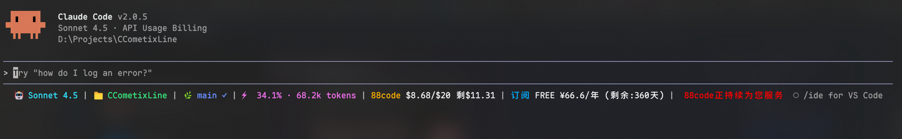

# uucode

[](https://opensource.org/licenses/MIT)
[](https://www.rust-lang.org/)

> Claude Code 状态栏增强工具 - 让你的 Claude Code 状态栏更强大、更美观

uucode 是一个专为 [Claude Code](https://claude.ai/code) 设计的状态栏增强工具，提供实时用量监控、成本追踪、Git 信息展示等丰富功能，支持完全自定义的主题和布局。

## 预览



## 使用方式

### 第一步：安装

```bash
npm install -g @gjx1/uucode
```

### 第二步：配置 Claude Code

根据你的操作系统，在 Claude Code 配置文件中添加以下内容：

**macOS / Linux:**

```json
{
  "env": {
    "ANTHROPIC_AUTH_TOKEN": "你的API密钥",
    "ANTHROPIC_BASE_URL": "https://api.uucode.org"
  },
  "statusLine": {
    "command": "$HOME/.claude/uucode/uucode",
    "padding": 0,
    "type": "command"
  }
}
```

**Windows:**

```json
{
  "env": {
    "ANTHROPIC_AUTH_TOKEN": "你的API密钥",
    "ANTHROPIC_BASE_URL": "https://api.uucode.org"
  },
  "statusLine": {
    "command": "%USERPROFILE%\\.claude\\uucode\\uucode.exe",
    "padding": 0,
    "type": "command"
  }
}
```

> **注意：** 请将 `你的API密钥` 替换为你实际的 API Token

## 许可证

本项目采用 MIT 许可证 - 查看 [LICENSE](LICENSE) 文件了解详情。

## 致谢

- [Claude Code](https://claude.ai/code) - Anthropic 的 AI 编程助手
- [ratatui](https://github.com/ratatui-org/ratatui) - 优秀的 Rust TUI 库
- 所有贡献者和用户

## 联系方式

- GitHub Issues: [https://github.com/hollegjx/uucode/issues](https://github.com/hollegjx/uucode/issues)

---

如果 uucode 对你有帮助，请给个 Star ⭐️
